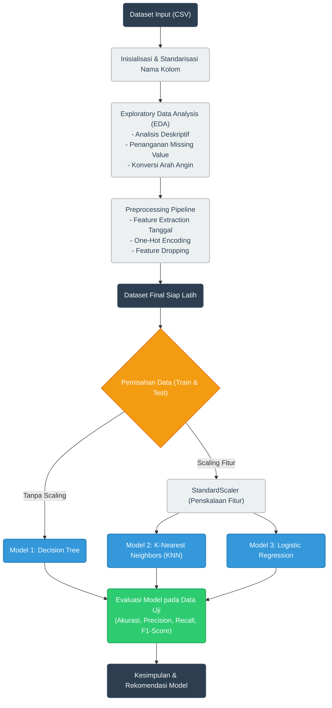

# Final Project LBE KCV - Prediksi Status Banjir Berdasarkan Parameter Cuaca dari BMKG Menggunakan Algoritma Linear Regression, Decision Tree, dan KNN

---

## Sumber Dataset

Dataset yang digunakan dalam proyek ini bersumber dari:
* **Dataset:** [Climate and Flood Jakarta](https://www.kaggle.com/datasets/christopherrichardc/climate-and-flood-jakarta/) (Kaggle)
* **Deskripsi:** Dataset ini berisi data historis parameter iklim/cuaca harian seperti temperatur, kelembapan, curah hujan, kecepatan angin, dan penyinaran matahari beserta label kejadian banjir di DKI Jakarta.

---

## Struktur Repositori


```text
├── FP_LBE_KCV.ipynb     # Jupyter Notebook utama
├── data_finish.csv      # File dataset 
└── requirements.txt     # Daftar pustaka (dependencies)
```

### Rincian File:
1. **`FP_LBE_KCV.ipynb`**: File Jupyter Notebook utama yang memuat alur lengkap eksperimen Machine Learning.
2. **`data_finish.csv`**: File input dataset cuaca historis yang wajib tersedia pada direktori yang sama untuk keperluan eksekusi kode dan demo presentasi.
3. **`requirements.txt`**: File konfigurasi dependensi Python yang memuat pustaka pendukung seperti `pandas`, `numpy`, `matplotlib`, `seaborn`, dan `scikit-learn`.

---

## Panduan & Cara Menjalankan

### 1. Instalasi Dependensi
Pastikan telah menginstal Python (disarankan Python 3.8+). Pasang seluruh pustaka yang diperlukan dengan menjalankan perintah:

```bash
pip install -r requirements.txt
```

### 2. Membuka Notebook (`FP_LBE_KCV.ipynb`)
Notebook dapat dibuka dan dijalankan melalui beberapa alternatif platform:

* **Jupyter Notebook / JupyterLab:**
  ```bash
  jupyter notebook FP_LBE_KCV.ipynb
  ```
* **Visual Studio Code (VS Code):**
  Buka folder repositori di VS Code, pilih file `FP_LBE_KCV.ipynb`, dan pastikan ekstensi **Jupyter** dan **Python** telah aktif.
* **Google Colab:**
  Unggah file `FP_LBE_KCV.ipynb` dan `data_finish.csv` ke dalam sesi Google Colab Anda.

---

> ### Peringatan Penting (Input Dataset)
> File **`data_finish.csv` WAJIB berada di dalam satu folder (direktori kerja) yang sama** dengan file **`FP_LBE_KCV.ipynb`**. Jika file dataset tidak berada di direktori yang sama, pembacaan data (`pd.read_csv('data_finish.csv')`) akan menghasilkan pesan *error (FileNotFoundError)*.

---

## Flowchart

